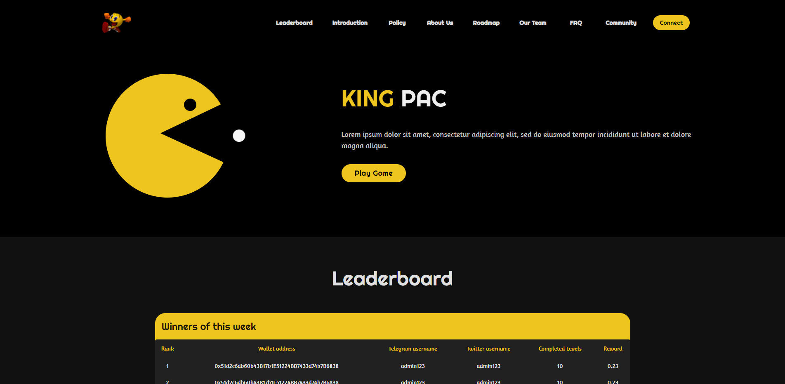

---
runme:
  id: 01HPJPJFFFBZ7H1Y0ESFNPXS5E
  version: v3
---

# Popular Pacman Go Backend

## Live sites

## Perquisites

- `Node.js v14.17.0`
- `MySQL v8.0.27`

## Stacks

- **Framework:** `Express.js v4.17.3`
- **Database:** `MySQL`

## How to run the game

1. Please open terminal window in the root directory.
2. Please run command `npm run start` in it.

## Contact To

- flatt.kenneth.wayne.jr@outlook.com
